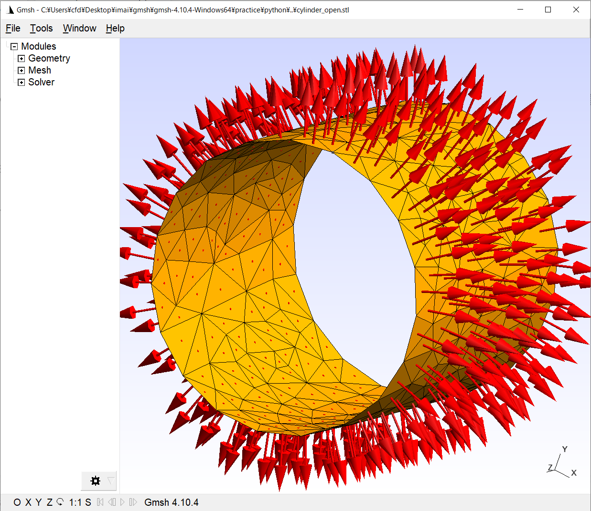

# 公式ドキュメントをしっかり読もう

なんか大体ドキュメントに書いてある気がする
最新バージョンのドキュメントがあるかもしれないから各自チェックしてくれ

[gmsh](https://gmsh.info/)

[公式ドキュメント](http://gmsh.info/dev/doc/texinfo/gmsh.pdf)

## tips

- 下記のスクリプトを入れ込めば、設定で二次元のメッシュの可視化を毎回ONにする操作をしなくて良くなる

  ```sh
  gmsh.option.setNumber("Mesh.SurfaceFaces", 1)
  ```

- 下記のスクリプトを入れ込めば、マウスのホイールのズームの逆転が慣れ親しんだものになる

  ```sh
  gmsh.option.setNumber("General.MouseInvertZoom", 1)
  ```

## 解決したい疑問

- 下記のスクリプトはどの段階で実行するのがいいの？

  ```sh
  gmsh.model.geo.synchronize()
  ```

- 面を定義したとき結局どっちが法線方向なの
  - 中身が空洞の一枚の皮のような円筒を考えたとき法線を定義する表面は内側、外側どっちか？
    - なんか外側からさらに外側に向かって法線ベクトルが描画される
      
    - [法線を表示する方法](https://www.rccm.co.jp/icem/pukiwiki/index.php?2D%E3%83%A1%E3%83%83%E3%82%B7%E3%83%A5%E3%81%AE%E6%B3%95%E7%B7%9A%E6%96%B9%E5%90%91%E3%83%99%E3%82%AF%E3%83%88%E3%83%AB%E3%81%AE%E8%A1%A8%E7%A4%BA%28Gmsh%29)

- <class list>じゃダメで、<class numpy.ndarray>でないとダメらしい

  ```sh
  e = gmsh.model.geo.extrudeBoundaryLayer(gmsh.model.getEntities(2), n, -d, True)
  ```
