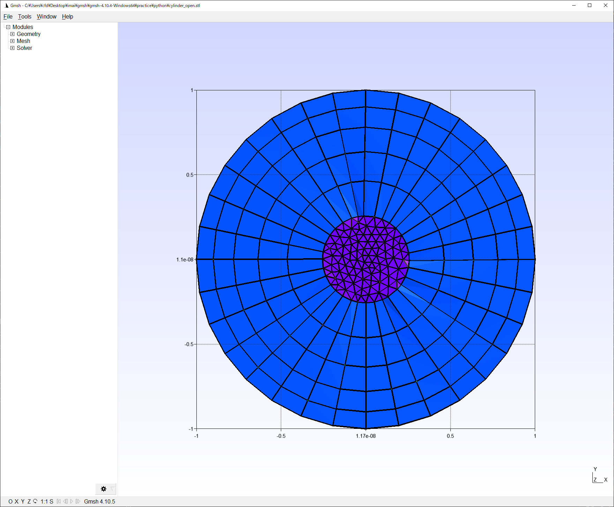
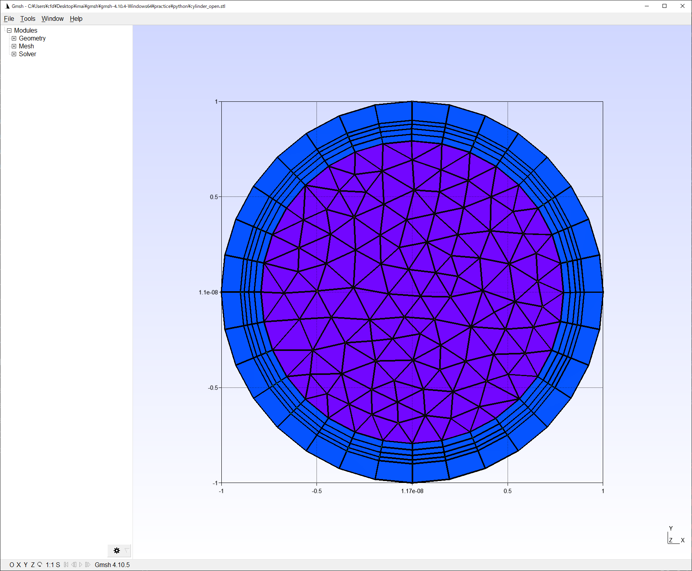

# gmshにおける血管モデルのメッシュ作成について

[gmsh](https://gmsh.info/)

最新バージョンのドキュメントがあるかもしれないから各自チェックしてください  
4.10.5を使用中（随時アップグレード予定）

[公式ドキュメント](http://gmsh.info/dev/doc/texinfo/gmsh.pdf)
[開発ディレクトリ](https://gitlab.onelab.info/gmsh/gmsh)

- python経由でgmshを開いてるっぽいので、gmshを直接ダウンロードしなくてよい？
  - バージョンアップしたかったら以下のコマンドをたたけばいいっぽい  
    こうすれば勝手にバージョンアップされたgmshを見に行く

    ```sh
    pip install --upgrade gmsh
    ```

## tips

- 全体的なtips

  - 公式ドキュメントを読もう  
    なんか大体ドキュメントに書いてある気がする  

  - 下記のスクリプトを入れ込めば、設定で二次元のメッシュの可視化を毎回 ON にする操作をしなくて良くなる

    ```sh
    gmsh.option.setNumber("Mesh.SurfaceFaces", 1)
    ```

  - 下記のスクリプトを入れ込めば、マウスのホイールのズームの逆転が慣れ親しんだものになる

    ```sh
    gmsh.option.setNumber("General.MouseInvertZoom", 1)
    ```

  - 出力をファイルに残したいなら  
    gmsh上でlogファイルを残す方法があるか調査中

    ```sh
    # powershell(windows)なら
    python .\aneurysm.py > .\aneurysm.txt 2>&1 
    # macなら
    # linuxなら
    ```

  - メッシュの出力形式を変更できる
    - <strong>OpenFOAMのgmshToFoamを使用するためにはmsh2の形式で出力したものを使う必要がある</strong>

    ```sh
    # mshで出力
    gmsh.write("cylinder_open.msh")
    # msh2で出力
    gmsh.write("cylinder_open.msh2")
    # vtkで出力
    gmsh.write("cylinder_open.vtk")
    ```

  - msh2形式について
    - [msh2の説明サイト](http://www.manpagez.com/info/gmsh/gmsh-2.2.6/gmsh_63.php)に乗っている通り(公式ドキュメントにも乗っている)
    - elementsについて  
    ```sh
    element_number, element_type, ?, physical_number, entities_number, node_list
    (例)
    1 2 2 1 2 56 138 137
    要素番号1, 要素タイプ2(二次元の三角形), ?, どこのphysicalに所属するか1, どこのentitiesに所属するか2, 要素がどのノードによって作られるか(56と138と137)
    ```

- メッシュ作成に関するtips

  - 境界層の作り方
    - 基本的にはこの関数を用いて設定する

      ```sh  
      e = gmsh.model.geo.extrudeBoundaryLayer(gmsh.model.getEntities(2), n, -t, True)
      ```

      gmsh.model.getentities(2):2次元の形状要素に対して  
      n:各層は何枚はるのか(n = np.linspace(1, 1, N) # [1,1,1,1,1]で指定するのがよい、N(=5)は層の数、これで各層が1枚で合計5枚になる、基本的にはこの設定でよい)  
      t:どれくらいの厚さにするのか
      True:レイヤー内のメッシュの再結合するか
      - 境界層(boundary layer)の層ごとの厚さの変数の方は list じゃダメで、numpy.ndarray でないとダメ?  
      そんなこともないらしい？  
      **nとdの型が一致していれば大丈夫っぽい**  
      **nに関しては、それぞれの層において何枚の小層を作るか的な指定をすることになっている、n = np.linspace(1, 5, 5)にすると、1+2+3+4+5の合計15枚が張られることになる**
      **それぞれのd[i]の厚さをi番目の層の厚さとしているのではなく、i番目の層を元々の基準線からどれくらいの距離に取るかを設定している模様**
    - 成功例  
       
    - 失敗例:これはtの配列またはlistを各層の厚さとして勘違いして作った
        


  - stlを読み込んだ際に法線の確認方法とその定義
    - 中身が空洞の一枚の皮のような円筒を考えたとき法線を定義する表面は内側、外側どっちか？
    - なんか外側からさらに外側に向かって法線ベクトルが描画される  
      多分普通にstlの法線を出力してるだけ  
      [法線を表示する方法](https://www.rccm.co.jp/icem/pukiwiki/index.php?2D%E3%83%A1%E3%83%83%E3%82%B7%E3%83%A5%E3%81%AE%E6%B3%95%E7%B7%9A%E6%96%B9%E5%90%91%E3%83%99%E3%82%AF%E3%83%88%E3%83%AB%E3%81%AE%E8%A1%A8%E7%A4%BA%28Gmsh%29)  
        

- 2d_airfoil.pyに関してはこのサイトを見てください

  - [参考にしたサイト](https://mtkbirdman.com/gmsh-v4-6-0-python-2dairfoil)

## 解決したい問題

- 下記のスクリプトはどの段階で実行するのがいいの？

  ```sh
  gmsh.model.geo.synchronize()
  ```

## markdownのtips

- markdownのリスト内の改行は文末に半角空白2ついれればOK  
  こうすればOK

- **アスタリスク2個で挟めば強調だよ**
